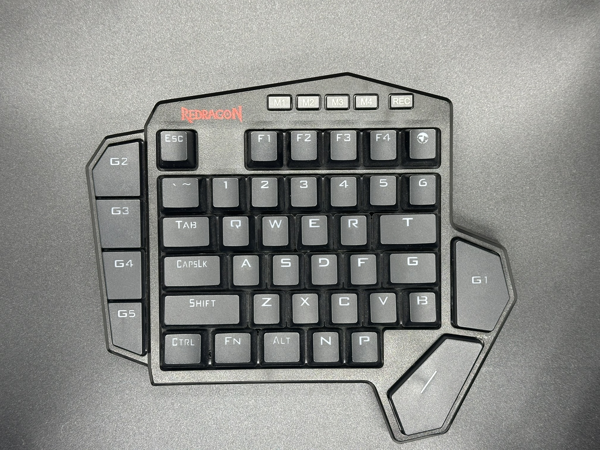
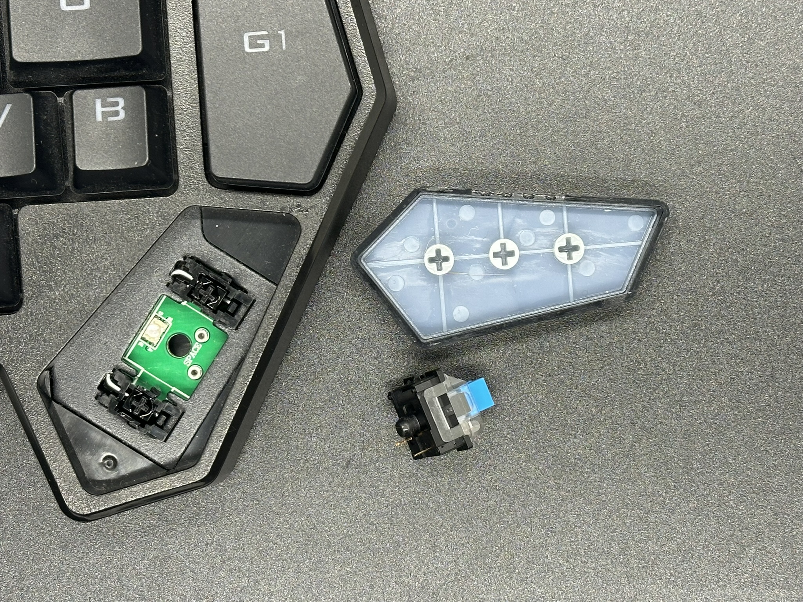
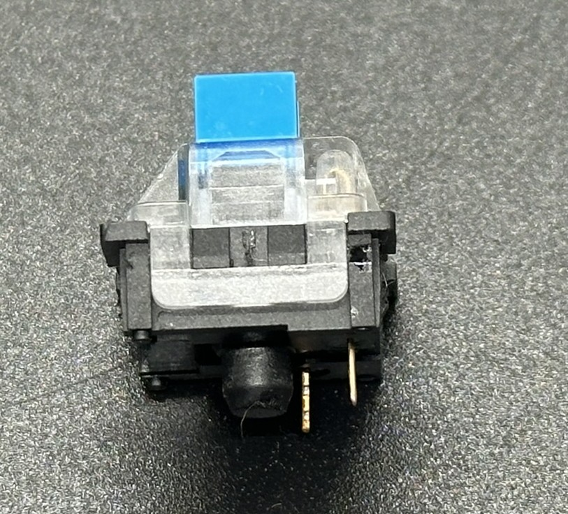
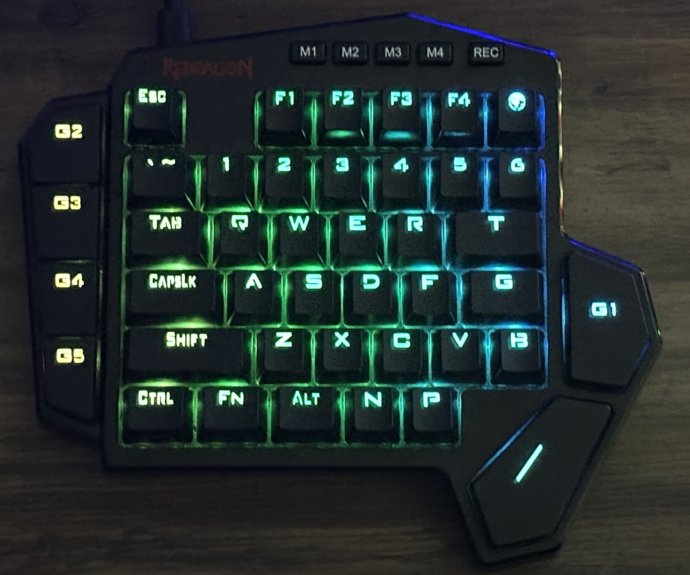

# Redragon K585 Keyboard

The Redragon K585 is a `42` key mechanical keyboard with `RGB` backlighting.

## Connections

### USB-C
There is a `USB-C` at the top left of the keyboard which is used as the output to be connected to the computer.

### USB-A

The `USB-A` port next to the `USB-C` port is used to connect another device to the keyboard which sends all the data to the computer using the `USB-C` port.

## Notes

### Linux identification
Linux identified the keyboard as `Evision RGB Keyboard` with the following `lsusb` output:

```
ID 320f:5000 Evision RGB Keyboard
```

The keyboard is most likely using a microcontroller from `Evision`. Their site can be found here but most of it is in chinese: [Evision](http://www.eevision.com/)

```bash
usb 1-12: new high-speed USB device number 30 using xhci_hcd
usb 1-12: New USB device found, idVendor=1a40, idProduct=0101, bcdDevice= 1.11
usb 1-12: New USB device strings: Mfr=0, Product=1, SerialNumber=0
usb 1-12: Product: USB 2.0 Hub
hub 1-12:1.0: USB hub found
hub 1-12:1.0: 4 ports detected
usb 1-12.1: new full-speed USB device number 31 using xhci_hcd
usb 1-12.1: not running at top speed; connect to a high speed hub
usb 1-12.1: New USB device found, idVendor=320f, idProduct=5000, bcdDevice= 1.07
usb 1-12.1: New USB device strings: Mfr=1, Product=2, SerialNumber=0
usb 1-12.1: Product: RGB Keyboard
usb 1-12.1: Manufacturer: Evision
```

## Images

### Top


### Board


### Switch



### Lights



## Keymap

```
            M1  M2  M3  M4  REC
G2  ESC F1  F2  F3  F4  GLOBE
G3  `   1   2   3   4   5   6
G4  TAB Q   W   E   R   T
G5  CAP A   S   D   F   G
    SHI Z   X   C   V   B         G1
    CTL FN  ALT N   P         SPACE
```