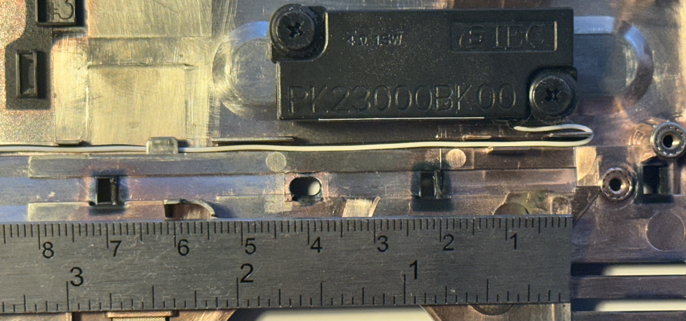
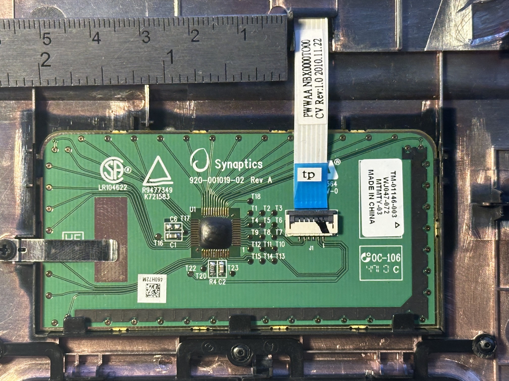
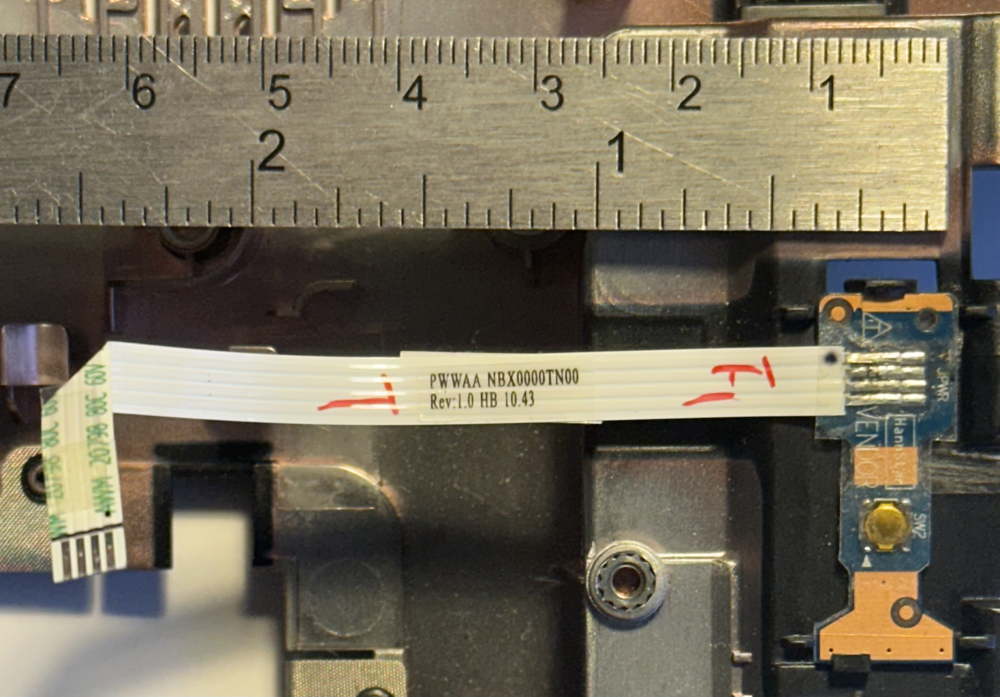

# TOSHIBA C660

The toshiba C660 is a laptop that was released in 2010. It runs windows 7 and has a 15.6 inch screen. Its hard drive is 320GB and it has 4GB of RAM.

## Board images

## Other parts

### Speaker

### Keyboard

### Power button
