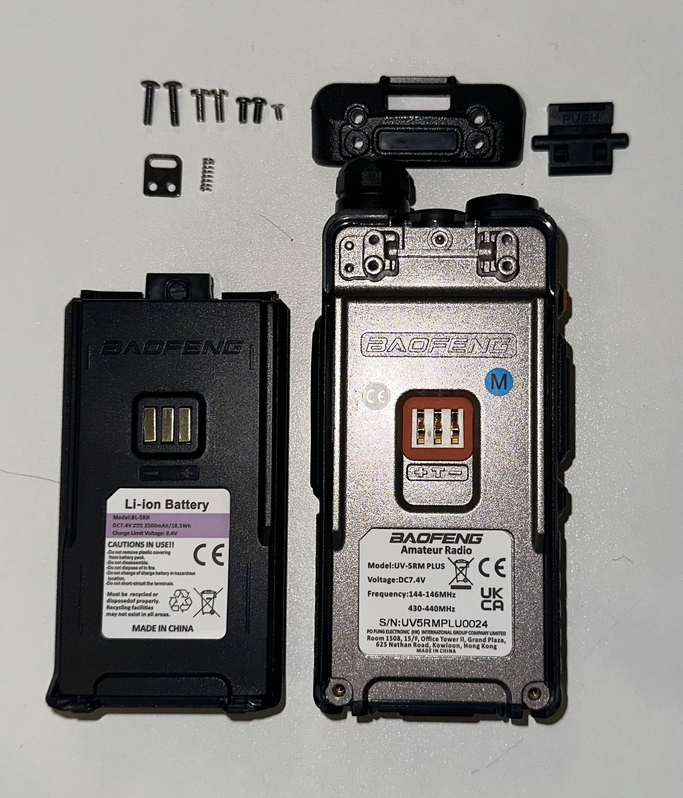
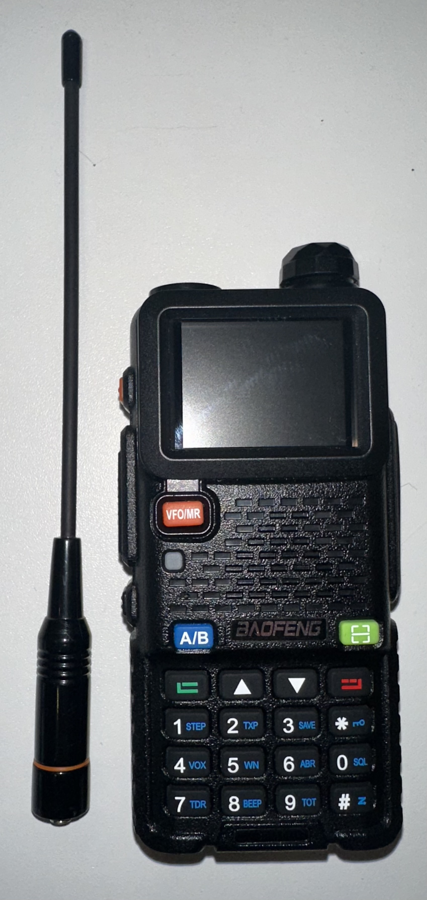
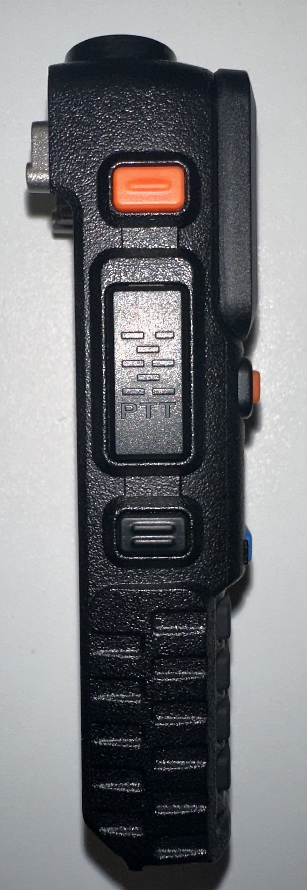
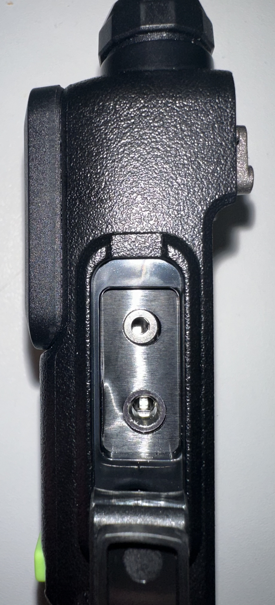
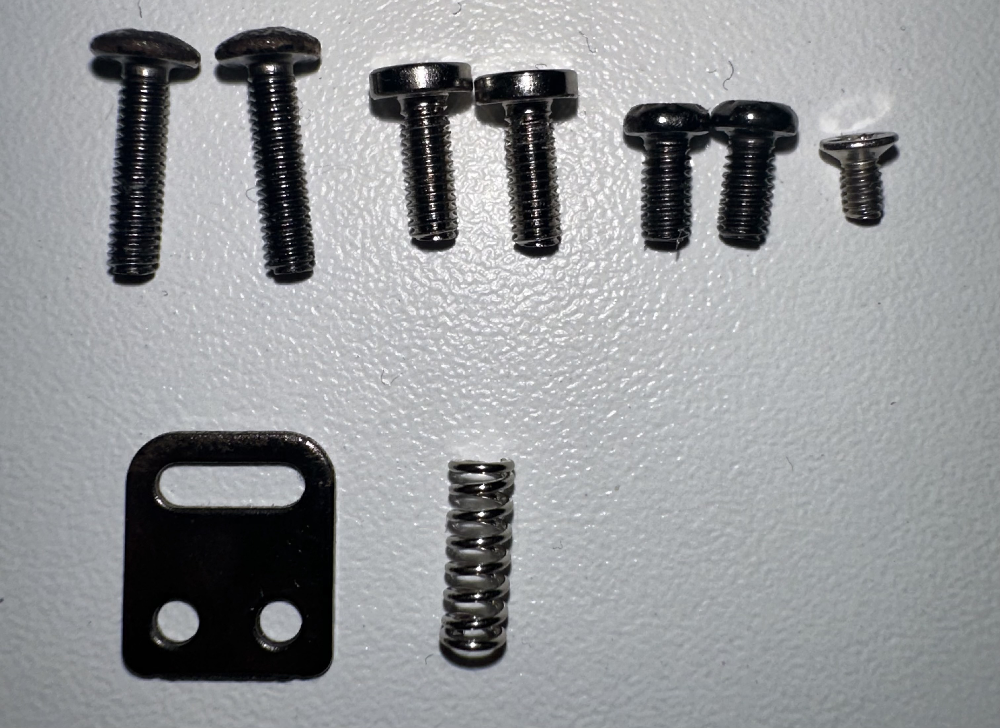

# Baofeng UV-5RM Plus

The Baofeng UV-5RM Plus is a dual-band handheld transceiver that is part of the UV-5R series of radios.

## Images

## Specifications

### Frequency Range

- 108.0000000 MHz - 135.997500 MHz (No transmit AM)
- 144.0000000 MHz - 145.997500 MHz (2m HAM)
- 430.0000000 MHz - 439.997500 MHz (70cm HAM)

### Other

- **Input voltage**: 7.4 Volts
- **Battery model**: BL-5RH
- **Battery capacity**: 2500 mAh