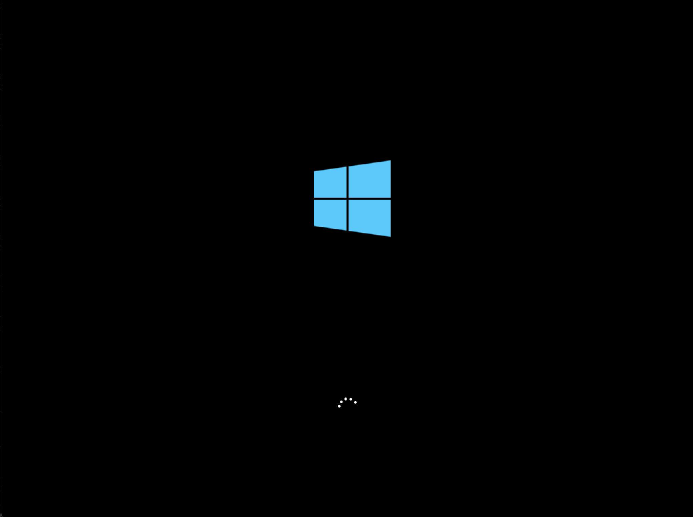

# Installing windows 10

Installing windows 10 is a simple process that can be done by almost anyone. This guide will show you how to install windows 10 on your computer.

First you will need a CD or USB with the windows 10 installation files. You can download the installation files from the [official microsoft website](https://www.microsoft.com/en-us/software-download/windows10).

## Steps

### Booting using the installation media

When you boot the computer you should see a message that says "Press any key to boot from CD or DVD". Press any key to boot from the installation media.

### Booting

You should now see a logo of windows (or your computer manufacturer) and a spinning circle. This means that the installation media is booting.

### Language and keyboard settings

Select your language, time and currency format, and keyboard or input method. Click "Next" to continue.

### Activating windows

Since windows is not a free you will need to activate it using a licence key. If you have a licence key enter it here, if not you can skip this step and activate windows later.

### Select windows edition

There are multiple editions of windows 10, select the one that you want to install.

#### Windows 10 Home

Windows 10 Home is the basic edition of windows 10. It is suitable for most users.

#### Windows 10 Pro

Windows 10 Pro is the professional edition of windows 10. It has more features than windows 10 home.

#### Windows 10 Education

Windows 10 Education is designed for students and teachers. It has the same features as windows 10 pro.

#### Windows 10 Enterprise

Windows 10 pro but designed for large organizations.

#### Windows version N

Windows version N is the same as the but stands for "No Media Player".

### Choose a disk to install to

This screen shows all the disks that are connected to your computer. Select the disk that you want to install windows to and click "Next".

### Installing windows

The next screen will show the progress of the installation. This can take a while depending on the speed of your computer. After this screen you should see the windows logo and a spinning circle. After that there will be a setup screen which will let you configure your windows settings.